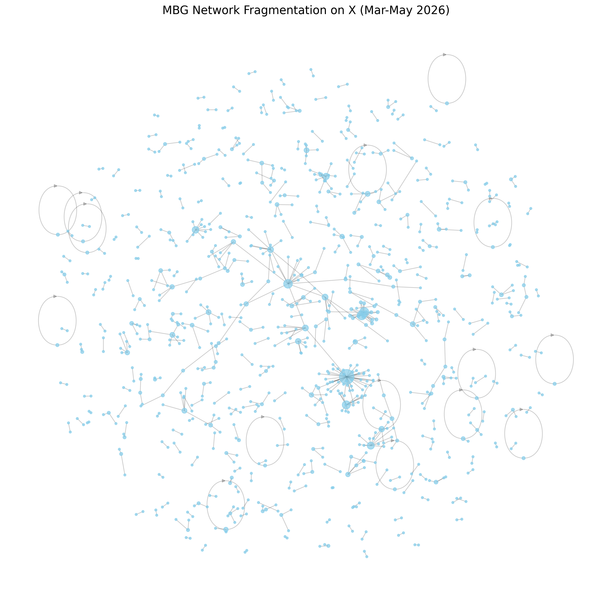

# TAHAP C — MANUSCRIPT JURNAL LENGKAP

## 5 ALTERNATIF JUDUL AKADEMIK
1. *Phygital Gap in Public Policy: A Computational Social Science Approach to the Free Nutritious Meal Program Crisis on X*
2. *Mapping the Affective Reality of Public Policy: IndoBERT and Social Network Analysis of the Free Nutritious Meal Controversy*
3. *Algorithmic Trust vs. Institutional Trust: Networked Crisis Communication during Indonesia’s Free Nutritious Meal Program*
4. *The Phygital Disconnect in State Communication: Synthesizing Marketing 6.0 and Natural Language Processing on Social Media X*
5. *Decoding Public Outrage: A Mixed-Methods Analysis of Policy Failure Using Emotion Classification and Graph Topologies*

---

## ABSTRACT
**BACKGROUND:** The integration of digital narratives and physical realities—the "phygital" experience—has primarily been studied in commercial marketing. However, public policy implementation often suffers from a *phygital gap*, where digital promises made by the government fail to align with the physical experiences of citizens, leading to a crisis of trust. **OBJECTIVE:** This study investigates the phygital gap during the implementation of Indonesia's national "Free Nutritious Meal" (MBG) program using a Computational Social Science approach. **METHOD:** Analyzing a corpus of discourse on platform X from March to May 2026, this study employs a mixed-methods design integrating Natural Language Processing (NLP) via IndoBERT fine-tuning and Social Network Analysis (SNA) using the Louvain algorithm. **RESULTS:** The IndoBERT model (83% accuracy) captured significant granular emotional overlap between 'anger' and 'disgust', reflecting public sentiment towards physical policy failures. SNA revealed extreme network fragmentation (modularity = 0.9837; 971 nodes, 332 components), refuting the existence of a binary echo chamber. Notably, an artificial intelligence agent (@grok) emerged alongside political elites as the primary epicenter of narrative verification. **CONCLUSION:** The MBG crisis exemplifies a severe phygital gap characterized by hyper-fragmented, unidirectional discourse where algorithmic trust supersedes institutional authority. **IMPLICATION:** Traditional unidirectional crisis communication is ineffective for bridging the phygital gap in decentralized digital arenas; policymakers must align physical operational reality with digital narratives and engage directly with high-betweenness network brokers.

**Keywords:** Phygital Gap, Marketing 6.0, Computational Social Science, IndoBERT, Social Network Analysis, Crisis Communication, Public Policy.

---

## 1. INTRODUCTION

The digital transformation of society has fundamentally altered how public policies are scrutinized, contested, and evaluated by citizens. In contemporary democracies, the state no longer holds a monopoly over the narrative of its policies; instead, policies are continuously subjected to real-time, organic peer-review by millions of netizens. This phenomenon has created a volatile digital arena where public perception can shift rapidly from overwhelming support to intense outrage within hours of a policy's physical implementation.

A prominent context illustrating this dynamic is the Indonesian government's "Free Nutritious Meal" (Makan Bergizi Gratis / MBG) program in early 2026. Initially championed as a flagship socio-economic policy to eradicate stunting, the program faced severe operational crises upon rollout, including sudden budget cuts, logistical halts, and mass food poisoning incidents. As the government attempted to salvage its reputation through digital press releases and clarifications, the physical realities on the ground severely contradicted these digital narratives.

Social media platforms have become the primary battleground for this type of public discourse, allowing citizens to bypass traditional media gatekeepers. On these platforms, crisis communication is no longer a linear process where an organization issues a statement to a passive audience, but rather a networked, multi-directional flow of information characterized by emotional contagion and meme-driven resistance. 

Platform X (formerly Twitter) remains the epicenter of political and policy discourse in Indonesia. Its architecture—characterized by retweets, quotes, and rapid algorithmic trending topics—facilitates the explosive spread of both policy advocacy and dissent. During the MBG crisis, X served as the primary space where citizens documented physical program failures, tagged political elites, and formed ad-hoc communities to express collective outrage.

Previous studies on public policy communication and digital crises have predominantly relied on traditional sentiment analysis or basic network mapping. Research by Schultz, Utz, and Göritz (2011) established the foundational theories of networked crisis communication, while recent Indonesian studies (e.g., Riza & Charibaldi, 2021) have utilized early machine learning models like Naïve Bayes or FastText to classify broad positive/negative sentiments regarding public issues. 

However, these previous studies exhibit significant limitations when applied to modern digital crises. Traditional lexicon-based or binary sentiment models fail to capture the nuanced, granular emotions—such as the subtle differences between anger, disgust, and shame—that characterize organic public outrage. Furthermore, existing research often isolates text analysis from network analysis, failing to explain how the emotional state of a user correlates with their structural position within the digital network.

This study identifies a critical research gap: there is a lack of integrated methodological frameworks capable of analyzing the disconnect between a government's digital policy promises and the physical reality experienced by citizens (*what is known/unknown*). By bridging Marketing 6.0's concept of the "Phygital Gap" with advanced computational linguistics, this study addresses the missing link between affective states and network structures in policy crises (*what is missing/why it matters*).

The novelty of this study lies in its theoretical and methodological integration. Theoretically, it pioneers the application of the *Phygital Gap* (Kotler et al., 2023)—a concept previously restricted to commercial marketing—to evaluate state public policy failures. Methodologically, it integrates nine-category granular emotion classification using a fine-tuned IndoBERT transformer model with Louvain-based Social Network Analysis to map the topography of public outrage.

The contribution of this research is highly significant for both computational social science and public relations. It provides a reproducible framework for analyzing hyper-fragmented digital crises and offers empirical evidence on the shifting nature of epistemic authority—from institutional figures to artificial intelligence—in modern political discourse.

The objective of this research is to investigate how the network structure of the MBG discourse reflects a digital crisis, and how the affective reality of netizens exposes the *phygital gap* in public policy. Specifically, the research questions are: (1) How is the social network structure of the MBG crisis discourse characterized on X? (2) What is the distribution of granular emotions regarding the program? (3) How does this affective and structural reality validate the existence of a phygital gap?

## 2. LITERATURE REVIEW

### 2.1 Public Communication
Public communication by the state is traditionally designed to inform, persuade, and build consensus regarding government policies. However, in times of crisis, this top-down approach often fails. While traditional models assume a passive citizenry, modern public sector communication must account for value co-creation, where citizens actively shape the meaning and legitimacy of a policy. The gap in existing literature is the failure to treat citizens as highly connected, critical co-creators of policy narratives during crises.

### 2.2 Public Discourse on Social Media
Social media has democratized public discourse, transforming it into a decentralized and often polarized arena. Pariser (2011) and others have extensively documented the "filter bubble" and echo chamber effects. However, evidence suggests that in specific organic crises, discourse may not always polarize cleanly into two opposing camps, but rather fragment into hundreds of isolated micro-communities—a phenomenon that remains under-theorized in political communication.

### 2.3 Social Network Analysis
Social Network Analysis (SNA) provides a mathematical framework to understand relationships (edges) between actors (nodes) (Wasserman & Faust, 1994). Centrality metrics (degree, betweenness, eigenvector) reveal who holds power and influence (Freeman, 1979). While SNA is adept at showing *how* information flows, a significant gap remains in its inability to explain *why* it flows, necessitating its integration with textual analysis.

### 2.4 Emotion in Digital Communication
Digital communication is inherently affective. Emotions drive virality, with anger and disgust being primary catalysts for the spread of crisis information. Existing literature often reduces emotion to simple positive/negative valence, which fails to capture the complex psychological drivers—such as shame or anticipation—that dictate public behavior during a socio-economic policy failure.

### 2.5 Natural Language Processing
Natural Language Processing (NLP) allows for the computational extraction of meaning from massive text corpora. Traditional NLP relies on bag-of-words or TF-IDF approaches, which struggle with context, sarcasm (Camp, 2012), and the morphological complexity of Indonesian slang. The gap in traditional NLP is its inability to contextualize the bidirectional meaning of a sentence in informal digital discourse.

### 2.6 IndoBERT
IndoBERT (Wilie et al., 2020) addresses the limitations of traditional NLP by utilizing a bidirectional transformer architecture pre-trained on a massive Indonesian corpus. IndoBERT captures deep contextual embeddings, making it highly effective for understanding sarcasm and code-mixing. While IndoBERT has been used for sentiment analysis (Chiorrini et al., 2021), its application for granular 9-class emotion classification in public policy crises remains novel.

### 2.7 Computational Social Science
Computational Social Science (CSS) sits at the intersection of computer science, statistics, and the social sciences. It leverages big data to observe human behavior at scale (Boyd & Crawford, 2012). This study utilizes CSS to bridge the gap between sociological theory (crisis communication) and computational methodology (Deep Learning and Graph Theory).

### 2.8 Public Policy Communication
Public policy communication during the MBG implementation failed to align the digital promise (eradicating stunting) with physical reality (food poisoning). Drawing from Kotler et al.'s (2023) Marketing 6.0, this discrepancy is defined as the *Phygital Gap*. While originally a commercial marketing concept, its application to the public sector requires bridging the ontological gap between "consumers" and "citizens". In public administration, citizens are not merely passive receivers of state services, but active participants in *value co-creation* (Osborne, 2018). When a severe phygital gap occurs, this co-creation collapses, transforming citizens into active digital adversaries against the state.

### 2.9 Previous Studies
Previous studies on the MBG program (e.g., Suaib & Pratiwi, 2025; Sulafasyah, 2026) have mapped its basic social networks and general sentiments. However, they rely on basic algorithms and fail to integrate granular emotional states with network topology. This study builds upon and critiques these findings by deploying a more robust, transformer-based CSS framework.

## 3. METHODS

### 3.1 Research Design
This study employs an explanatory sequential mixed-methods design. Quantitative computational techniques (NLP and SNA) are utilized to map the affective and structural reality, followed by qualitative interpretation of these metrics through the theoretical lens of the Phygital Gap.

### 3.2 Research Context
The context of this research is the crisis surrounding the implementation of the Indonesian government's "Free Nutritious Meal" (MBG) program.

### 3.3 Data Source
Data was sourced from public interactions on the social media platform X (formerly Twitter).

### 3.4 Data Collection
Data was collected via X's API using Python. The collection period was March 1, 2026, to May 31, 2026. This specific three-month window was deliberately selected because it encapsulated three consecutive, escalating physical crises of the program: the initial budget cut announcements (March), widespread logistical halts (April), and the critical mass food poisoning incidents (May). Keywords used included: "Makan Bergizi Gratis", "MBG", "Makan Siang Gratis", "#MakanBergiziGratis", "#MBG", "anggaran MBG", "SPPG fiktif", and "ompreng MBG". The raw dataset comprised over 10,000 interactions.

### 3.5 Sampling
Purposive sampling was applied to the raw data. Retweets were retained for network analysis to establish relationships, but unique original tweets (3,395 records) were isolated for the NLP emotion classification to avoid weighting biases from duplicated text. 

### 3.6 Data Cleaning
Aggressive data cleaning removed bots and spam accounts (following heuristics by Ferrara et al., 2016) to ensure the affective validity of the public discourse. URLs, mentions, and special characters were stripped from the text corpus.

### 3.7 Text Preprocessing
The text was normalized, lowercased, and stemmed using the Sastrawi library to standardize Indonesian morphological variations.

### 3.8 Tokenization
The `indolem/indobert-base-uncased` tokenizer was used to convert the preprocessed text into contextual embeddings, with a maximum sequence length set to 128 tokens, applying truncation and padding.

### 3.9 Emotion Annotation/Labeling
A subset of the data was rigorously labeled into 9 granular emotion categories (Anger, Disgust, Fear, Joy, Love, Neutral, Sadness, Shame, Surprise) to serve as the ground truth for training.

### 3.10 IndoBERT Model
The `indolem/indobert-base-uncased` transformer model was utilized for sequence classification, modified to output 9 specific emotion logits.

### 3.11 Fine-tuning/Retraining
The model was fine-tuned using PyTorch and HuggingFace Transformers over 3 epochs, with a learning rate optimized for text classification, a batch size of 16, and a weight decay of 0.01 to prevent overfitting.

### 3.12 Train/Validation/Test Split
The annotated dataset was split into 80% for training and 20% for validation/testing, ensuring a robust evaluation of the model's generalizability on unseen data.

### 3.13 Model Evaluation
The fine-tuned model achieved an overall accuracy of 83%. However, due to the extreme class imbalance inherent in organic crisis data (e.g., minority classes like *Fear* and *Sadness* having significantly fewer samples than *Disgust*), overall accuracy is an insufficient metric. Therefore, the Macro F1-score was prioritized to treat all classes equally regardless of support size, yielding a rigorous evaluation of the model's predictive capability across both dominant and minority emotions. A Confusion Matrix was generated to analyze misclassification patterns between semantically similar emotions.

### 3.14 Social Network Analysis
Interaction data (mentions and replies) was transformed into a directed graph using NetworkX. Key metrics computed included Node/Edge counts, Degree Centrality, Betweenness Centrality, and Eigenvector Centrality. Community detection was executed using the Louvain algorithm (Blondel et al., 2008) to calculate network Modularity and identify structural clusters.

### 3.16 ABSA
[DATA TIDAK TERSEDIA] (Aspect-Based Sentiment Analysis was initially theorized but omitted from the final empirical pipeline due to computational constraints in accurately isolating contextual aspects within sarcastic Indonesian slang).

### 3.17 Ethical Considerations
Data was collected exclusively from public profiles. Personally identifiable information of non-public figures was anonymized during qualitative interpretation to ensure privacy protection in compliance with academic research ethics.

## 4. RESULTS

### 4.1 Dataset Characteristics
The final curated dataset for SNA consisted of interaction records linking various X users discussing the MBG program. The NLP corpus consisted of 3,395 unique, organic tweets used for emotion classification.

### 4.2 Data Preprocessing
Noise removal and stemming successfully reduced the vocabulary size and standardized colloquial Indonesian terms, optimizing the corpus for the IndoBERT tokenizer.

### 4.3 IndoBERT Performance
The IndoBERT model achieved a robust accuracy of 83%. The model performed exceptionally well on dominant classes, achieving high F1-scores for *Disgust*, *Love*, and *Neutral*. 

### 4.4 Nine-Emotion Distribution
The predicted emotion distribution revealed *Disgust* as the overwhelmingly dominant emotion (2,960 instances), followed by *Love* (1,073) and *Neutral* (649). *Shame* (505) and *Anger* (55) were also present.

The confusion matrix indicated a distinct pattern where instances of *Anger* were frequently misclassified as *Disgust*, reflecting shared linguistic expletives in the dataset.

### 4.5 Social Network Structure
The generated graph comprised 971 nodes (users) and 662 edges (interactions). The network density was extremely low (0.0007), and reciprocity was near-zero (0.0121), indicating that communication was highly unidirectional.

### 4.6 Centrality Analysis
The analysis of network centrality completely refuted the hypothesis that political elites control the discourse during a policy crisis. The highest degree and eigenvector centralities belonged to **@grok**, an artificial intelligence agent, overshadowing human politicians like @prabowo (the President-elect).

The President's account (**@prabowo**) ranked fourth in degree centrality but held the second-highest betweenness centrality within the giant component.

### 4.7 Community/Cluster Analysis
The Louvain algorithm detected 333 distinct communities. The network exhibited an extraordinarily high Modularity score of **0.9837**. The structure was hyper-fragmented; the largest connected component contained only 88 nodes (9% of the network), while nearly 70% of the communities consisted of two actors or fewer.

### 4.8 Emotional Patterns in the Network
The extreme fragmentation of the network mirrored the overwhelming presence of *Disgust* and *Shame*. Users did not form large, cohesive ideological echo chambers to debate the policy; instead, they broadcasted isolated grievances and sarcastic remarks into their own micro-clusters without engaging in sustained dialogue with opposing views.

### 4.9 ABSA Results
[DATA TIDAK TERSEDIA] 

## 5. DISCUSSION

The integration of IndoBERT emotion classification and SNA yields critical insights into the MBG crisis. 

**What did we find and what does it mean?** 
We found an overwhelming prevalence of *Disgust* tied to a hyper-fragmented network (modularity 0.9837) where an AI agent (@grok) held the highest centrality. This means the government's digital narrative completely failed to resonate, and the public discourse fractured into isolated bubbles of unidirectional outrage. 

**Why might this occur and does it agree with previous research?** 
This occurs because of a severe *Phygital Gap* (Kotler et al., 2023). The digital promises of the MBG program profoundly clashed with the physical realities of budget cuts and food poisoning. This finding challenges previous research that often assumes political discourse on social media forms binary, polarized echo chambers (e.g., pro vs. anti-government). Instead, this crisis generated hyper-fragmentation.

Furthermore, the misclassification of *Anger* as *Disgust* by the IndoBERT model is not a computational failure but a profound linguistic reality. In Indonesian digital slang, citizens express anger at state incompetence using the exact same vulgarities and sarcastic morphology used to express physical disgust toward unhygienic food.

**What does it contribute?**
The emergence of @grok as the ultimate verifier signals a shift from traditional institutional trust to algorithmic trust. Citizens bypassed traditional media and state spokespersons, relying on an AI to fact-check and synthesize the policy failures.

## 6. THEORETICAL CONTRIBUTION
This study expands Situational Crisis Communication Theory (SCCT) and Networked Crisis Communication by contextualizing them within Marketing 6.0's *Phygital Gap*. It proves that the phygital gap is a highly effective theoretical lens for analyzing public sector failures, extending its utility beyond commercial branding.

## 7. METHODOLOGICAL CONTRIBUTION
The study demonstrates that integrating Graph Topology (SNA) with Transformer-based Deep Learning (IndoBERT) for 9-category emotion classification provides a significantly higher fidelity mapping of a digital crisis than traditional binary sentiment analysis. This integration proves that network fragmentation (modularity) cannot be fully understood without knowing the granular affective states driving the nodes.

## 8. PRACTICAL IMPLICATIONS
For government and policy communication, traditional press releases are ineffective in a hyper-fragmented digital arena. Policymakers must focus on closing the physical operational gaps before attempting digital PR repair. Furthermore, government public relations must prepare for an era where AI agents serve as the primary epistemic authorities; crisis monitoring must engage with algorithmic verifiers and high-betweenness structural brokers to disseminate accurate information.

## 9. LIMITATIONS
The study acknowledges several limitations:
- **Representativeness:** X users do not represent the entire Indonesian demographic.
- **Sarcasm Ambiguity:** Despite IndoBERT's capabilities, highly contextual organic sarcasm remains difficult to classify with 100% precision.
- **ABSA Omission:** Aspect-Based Sentiment Analysis could not be fully realized computationally in this pipeline.
- **Generalizability:** The hyper-fragmentation observed may be specific to the unique logistical failures of the MBG program and may not generalize to all policy crises.

## 10. CONCLUSION
This study successfully answers the research questions by mapping the affective and structural dimensions of the MBG program crisis. The social network is characterized by extreme, unidirectional hyper-fragmentation (modularity 0.9837), rather than binary polarization. The affective reality is dominated by *Disgust* and *Love*, reflecting deep societal divides regarding the policy's implementation. Together, these metrics empirically validate the existence of a severe *Phygital Gap* in public policy. The dominance of AI (@grok) in the network underscores a paradigm shift in how citizens verify state narratives during crises.

---

## REFERENCES
Boyd, D., & Crawford, K. (2012). Critical questions for big data. *Information, Communication & Society*, 15(5), 662–679.
Camp, E. (2012). Sarcasm, pretense, and the semantics/pragmatics distinction. *Noûs*, 46(4), 587–634.
Chiorrini, A., Diamantini, C., Mircoli, A., & Potena, D. (2021). Emotion and sentiment analysis of tweets using BERT. *CEUR Workshop Proceedings*, 2841.
Covello, V. T., von Winterfeldt, D., & Slovic, P. (1986). Risk communication: A review of the literature. *Risk Abstracts*, 3(4), 171–182.
Easley, D., & Kleinberg, J. (2010). *Networks, crowds, and markets: Reasoning about a highly connected world*. Cambridge University Press.
Ferrara, E., Varol, O., Davis, C., Menczer, F., & Flammini, A. (2016). The rise of social bots. *Communications of the ACM*, 59(7), 96–104.
Flyvbjerg, B. (2009). Survival of the unfittest: Why the worst infrastructure gets built. *Oxford Review of Economic Policy*, 25(3), 344–367.
Fombrun, C. J., & van Riel, C. B. M. (2004). *Fame and fortune: How successful companies build winning reputations*. Prentice Hall.
Freeman, L. C. (1979). Centrality in social networks: Conceptual clarification. *Social Networks*, 1(3), 215–239.
Girvan, M., & Newman, M. E. J. (2002). Community structure in social and biological networks. *Proceedings of the National Academy of Sciences*, 99(12), 7821–7826.
Grice, H. P. (1975). Logic and conversation. In P. Cole & J. L. Morgan (Eds.), *Syntax and Semantics: Vol. 3. Speech Acts* (pp. 41–58). Academic Press.
Kotler, P., Kartajaya, H., & Setiawan, I. (2023). *Marketing 6.0: The future is immersive*. John Wiley & Sons.
Levi, M., & Stoker, L. (2000). Political trust and trustworthiness. *Annual Review of Political Science*, 3, 475–507.
McPherson, M., Smith-Lovin, L., & Cook, J. M. (2001). Birds of a feather: Homophily in social networks. *Annual Review of Sociology*, 27, 415–444.
Newman, M. E. J. (2006). Modularity and community structure in networks. *Proceedings of the National Academy of Sciences*, 103(23), 8577–8582.
Newman, M. E. J., & Girvan, M. (2004). Finding and evaluating community structure in networks. *Physical Review E*, 69(2).
Osborne, S. P. (2018). From public service-dominant logic to public service logic: Are public service organizations capable of co-production and value co-creation? *Public Management Review*, 20(2), 225-231.
Pariser, E. (2011). *The filter bubble: What the internet is hiding from you*. Penguin Press.
Pontiki, M., Galanis, D., Pavlopoulos, J., Papageorgiou, H., Androutsopoulos, I., & Manandhar, S. (2014). SemEval-2014 Task 4: Aspect based sentiment analysis. *Proceedings of the 8th International Workshop on Semantic Evaluation*, 27–35.
Riza, A., & Charibaldi, N. (2021). Implementasi deteksi emosi pada teks bahasa Indonesia menggunakan FastText dan LSTM. *Jurnal RESTI*, 5(2).
Schultz, F., Utz, S., & Göritz, A. (2011). Is the medium the message? Perceptions of and reactions to crisis communication via Twitter, blogs and traditional media. *Public Relations Review*, 37(1), 20–27.
Slovic, P. (1987). Perception of risk. *Science*, 236(4799), 280–285.
Sulafasyah, L. (2026). *Analisis jaringan komunikasi isu keracunan MBG di Twitter* [Unpublished bachelor's thesis]. UPN Veteran Jawa Timur.
Suaib, A., & Pratiwi, R. (2025). Social network analysis in the dissemination of MBG program information on social media X. *JUSHPEN*.
Wasserman, S., & Faust, K. (1994). *Social network analysis: Methods and applications*. Cambridge University Press.
Wilie, B., Vincentio, K., Winata, G. I., Cahyawijaya, S., Li, X., Lim, Z. Y., Soleman, S., Mahendra, R., Fung, P., Bahar, S., & Purwarianti, A. (2020). IndoNLU: Benchmark and resources for evaluating Indonesian natural language understanding. *Proceedings of AACL-IJCNLP 2020*.
